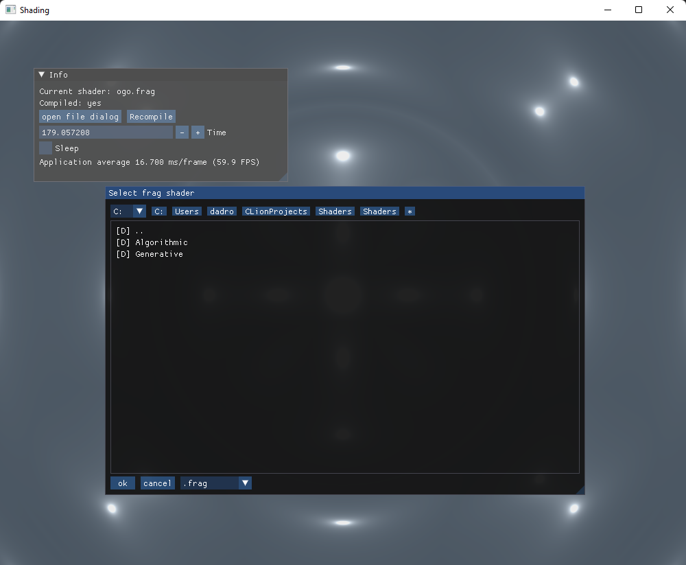

# Shaders

An application for viewing the shading result. 

Main motivation: learning the art of shading based on [The Book of Shaders](https://thebookofshaders.com/).

The disassembled shaders are in the `Shaders` folder

## Features

1. selecting a shader and recompiling it without leaving the application

2. manual adjustment of the time counter transmitted to the shader

3. The vertex shader is fixed.
   
## Build

`mkdir build | cd build`

`cmake .. [-DROOT_SHADERS_PATH=<path/to/root> (optional)]`

`cmake --build . -j12`

Note: The root folder where file viewer will open is specified by the first command line argument. Otherwise, define `ROOT_SHADERS_PATH` is used.

`ROOT_SHADERS_PATH` is set to the source folder by default by cmake.

## Gallery

